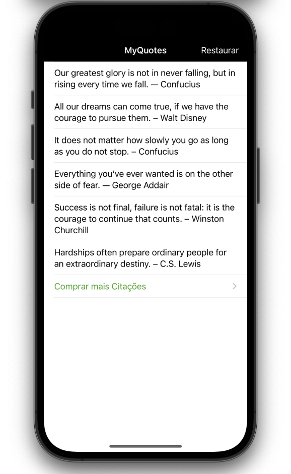

# MyQuotes

## What I've made

MyQuotes is a freemium app that gives free inspiration and a lot of paid inspiration. The project is based on the InspoQuotes app from App Brewery's

## What I learn

- How to setup new in-app purchases on App Store Connect
- How to use the StoreKit API to allow users to purchase premium content
- How to use the StoreKit API to detect failure cases
- How to use the StoreKit API to restore in-app purchases
- How to persist the state of users' purchases

> This is a project made from The App Brewery's Complete App Developement Bootcamp, check out at [www.appbrewery.co](https://www.appbrewery.co/)

